##### Noor
Noor is a CUDA/GPU Monte-Carlo path tracer that I've been working on for the past couple of years.  Although Noor is a powerful renderer it's still an experimental one that I wrote as a personal research tool (It is a work in progress).  I keep rewriting, redesigning, breaking, and fixing it on daily basis, so please keep that in mind if you decide to download the [source code](https://github.com/Ardook/Noor).    

The PBRT book has been instrumental in the development of Noor.  The book has been my constant companion for the past two years.  Noor started as a completely independent system, as I made progress in its development I gravitated more towards the design of the PBRT system.  In fact, some components such as the BSDF/BXDF, 1D/2D distributions, and cameras are the CUDA ports of the PBRT ones and as such the credit should be given to them. 
##### Development environment:
* Windows 10 64 bit 
* Visual Studio 2015 with Visual Assist 
* Nvidia CUDA ToolKit 9.1 and Nsight for Visual Studio 
* C++ (11 & 14)
* Autodesk Maya
* Gimp 

##### Acceleration Data Structures:
* BVH
* SBVH (removed)

##### Instancing:
* Multi-level BVH tree construction and traversal
* Support for large scenes with complex instancing of geometry

##### Primitives:
* Triangles
* Implicit surfaces like quads, disks, spheres, and cylinders (mesh lights)

##### Supported model/scene file formats:
* Alias Wavefront OBJ
* Autodesk FBX
   * Custom materials, lights, and cameras using MEL scripts

##### Supported image formats:
* JPG, jpg, TGA, BMP, PSD, GIF, HDR, PIC [(Sean Barrett)](https://github.com/nothings/stb). 
* EXR [(Syoyo Fujita)](https://github.com/syoyo/tinyexr).

##### Supported lights:
* Environment lighting (HDR and physical sky)
* Distant lights
* Area lights
* Point lights
* Spot lights
* Mesh area lights (quad, sphere, and disk)
* Infinite/environment light with importance sampling
* Physical sun/sky (Hosek) with importance sampling  
   * Cuda port of the Hosek & Wilkie implementation [(Hosek & Wilkie Sun & Sky Model)](http://cgg.mff.cuni.cz/projects/SkylightModelling/)

##### Texture:
* HDR and LDR
* Mipmapping
* Point, bi-linear, tri-linear, EWA (anisotropic) sampling
* Realtime Cuda image resizer and mipmap generator

##### Camera:
* Perspective with depth of field
* Orthographic
* Environment (360 degrees)

##### Work in Progress:
* Bidirectional path tracing
* Volume path tracing
* Subsurface scattering
* Multi-threaded BVH build
* Maya plugin

##### Resources and Credits: 
* PBRT (super bible of ray tracing)
* Mitsuba
* Nvidia Optix: excellent resource on the GPU side of things
* Solid Angle Arnold Renderer: ground truth
* Octane Renderer: ground truth
* Shader ball/knob License: CC BY 3.0 © Yasutoshi Mori
   * Removed the equations
   * Removed the backdrop
   * Removed all the textures
   * Only the knob is used
* HDRI 
   * Outdoor scenes [hdriheaven.com](https://hdriheaven.com)
   * Indoor scenes courtesy of Bernhard Vogl (used in Mitsuba also)
* Art assets
   * Train, cabin (only the cabin), and museum are from [3drender.com lighting challenge](http://www.3drender.com/challenges/)
   * The trees in the cabin scene are from [ORCA: Open Research Content Archive](https://developer.nvidia.com/orca/speedtree)
* PBR textures
   * [textures.com](https://textures.com)
   * [source allegorithmic](https://source.allegorithmic.com/)
* All the rest of the assets are created by me using Autodesk Maya

##### ScreenShots:
[{:height="128px" width="512px"}](screenshots/100percent/metal.jpg)

[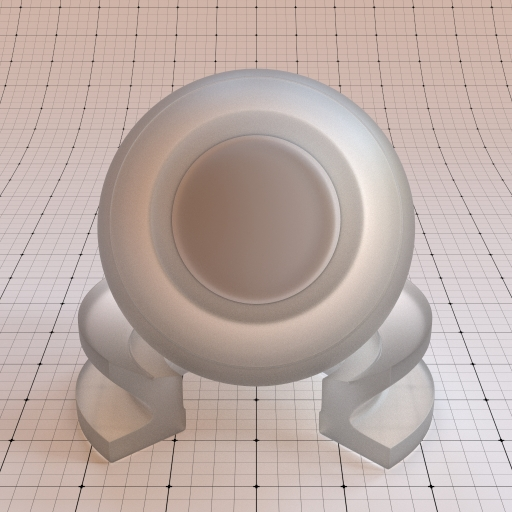](screenshots/100percent/screenshot-23-05-2018-18-10-35.jpg)

[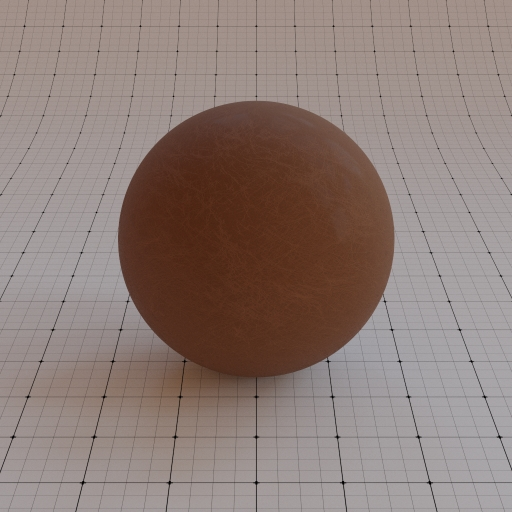](screenshots/100percent/screenshot-23-05-2018-14-41-06.jpg)

[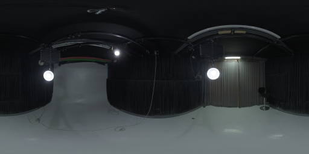](screenshots/100percent/screenshot-26-05-2018-18-14-15.jpg)

[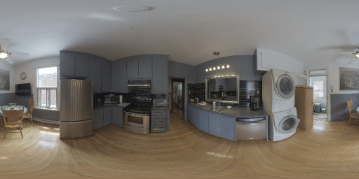](screenshots/100percent/screenshot-26-05-2018-18-15-29.jpg)
[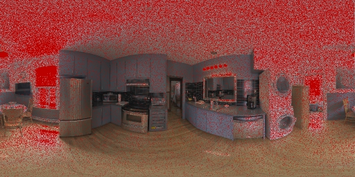](screenshots/100percent/screenshot-26-05-2018-18-15-35.jpg)

[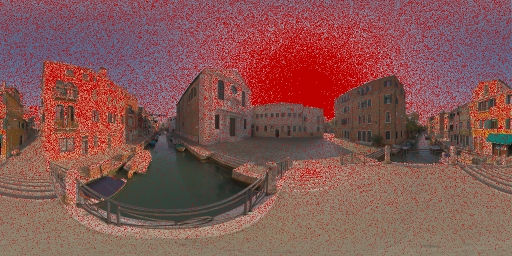](screenshots/100percent/screenshot-26-05-2018-18-18-09.jpg)
[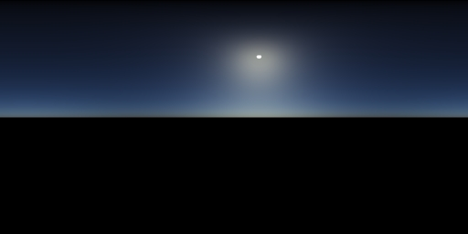](screenshots/100percent/screenshot-26-05-2018-18-25-14.jpg)
[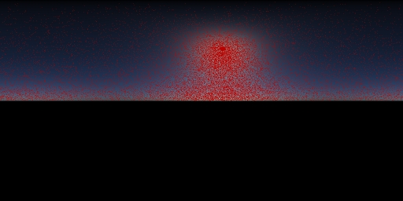](screenshots/100percent/screenshot-26-05-2018-18-25-20.jpg)
[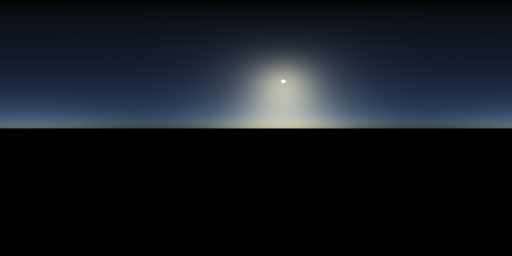](screenshots/100percent/screenshot-26-05-2018-18-25-28.jpg)
[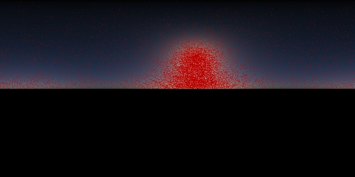](screenshots/100percent/screenshot-26-05-2018-18-25-30.jpg)
[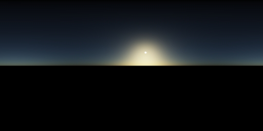](screenshots/100percent/screenshot-26-05-2018-18-25-38.jpg)
[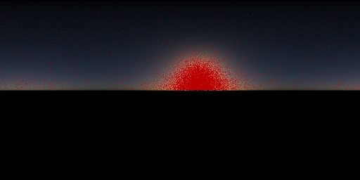](screenshots/100percent/screenshot-26-05-2018-18-25-41.jpg)

[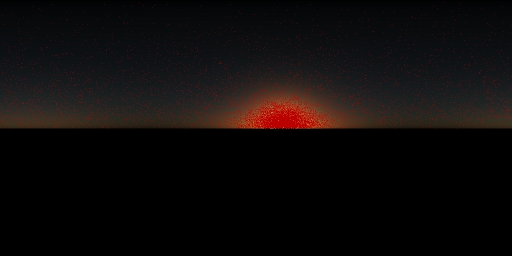](screenshots/100percent/screenshot-26-05-2018-18-25-54.jpg)