#### Noor
Noor is an experimental yet powerful CUDA pathtracer (with support for multiple GPUs).  It started (Noor 1.0) as part of a final class project (real-time Whitted raytracer) in 2009 and was recently resurrected as a pathtracer to assist me in learning and reinforcing the ideas and the topics covered in the PBRT book. 
 
#### Acceleration Data Structures:
* BVH
* SBVH (removed)

#### Instancing:
* Multi-level BVH tree construction and traversal
* Support for large scenes with complex instancing of geometry

#### Primitives:
* Triangles
* Implicit surfaces like quads, disks, spheres, and cylinders (mesh lights)

#### Supported model/scene file formats:
* Alias Wavefront OBJ
* Autodesk FBX
   * Custom materials, lights, and cameras using MEL scripts

#### Supported image formats:
* JPG, jpg, TGA, BMP, PSD, GIF, HDR, PIC [(Sean Barrett)](https://github.com/nothings/stb). 
* EXR [(Syoyo Fujita)](https://github.com/syoyo/tinyexr).

#### Supported lights:
* Environment lighting (HDR and physical sky)
* Distant lights
* Area lights
* Point lights
* Spot lights
* Mesh area lights (quad, sphere, and disk)
* Infinite/environment light with importance sampling
* Physical sun/sky (Hosek) with importance sampling  
   * Cuda port of the Hosek & Wilkie implementation [(Hosek & Wilkie Sun & Sky Model)](http://cgg.mff.cuni.cz/projects/SkylightModelling/)

#### Texture:
* HDR and LDR
* Mipmapping
* Point, bi-linear, tri-linear, EWA (anisotropic) sampling
* Realtime Cuda image resizer and mipmap generator

#### Camera:
* Perspective with depth of field
* Orthographic
* Environment (360 degrees)

#### Work in Progress:
* Bidirectional path tracing
* Volume path tracing
* Subsurface scattering
* Multi-threaded BVH build
* Maya plugin

#### Resources and Credits: 
* PBRT (super bible of ray tracing)
* Mitsuba
* Nvidia Optix: excellent resource on the GPU side of things
* Solid Angle Arnold Renderer: ground truth
* Octane Renderer: ground truth
* Pixar Luxo Jr. and Luxo Ball License: 
   * Lamp CC BY 3.0 © [pistiwique](https://www.blendswap.com/blends/view/75677)
   * Ball CC BY 0.0 © [ethomson92](https://www.blendswap.com/blends/view/91066) 
   * Exported from Blender and Imported to Maya	
   * Added Noor Custom PBR Material
* Utah Teapot: [University of Utah Rendering Competition](https://graphics.cs.utah.edu/trc/)
* SGI Logo: Whoever owns SGI today, [HP](https://www.hpe.com/us/en/solutions/hpc-high-performance-computing.html)
* Shader ball/knob License: CC BY 3.0 © Yasutoshi Mori
   * Removed the equations
   * Removed the backdrop
   * Removed all the textures
   * Only the knob is used
* HDRI 
   * Outdoor scenes [hdriheaven.com](https://hdriheaven.com)
   * Indoor scenes courtesy of Bernhard Vogl (used in Mitsuba also)
* Art assets
   * Train, cabin (only the cabin), and museum are from [3drender.com lighting challenge](http://www.3drender.com/challenges/)
   * The trees in the cabin scene are from [ORCA: Open Research Content Archive](https://developer.nvidia.com/orca/speedtree)
* PBR textures
   * [textures.com](https://textures.com)
   * [source allegorithmic](https://source.allegorithmic.com/)
* All the rest of the assets are created by me using Autodesk Maya

#### ScreenShots:
||
|Metals|
|[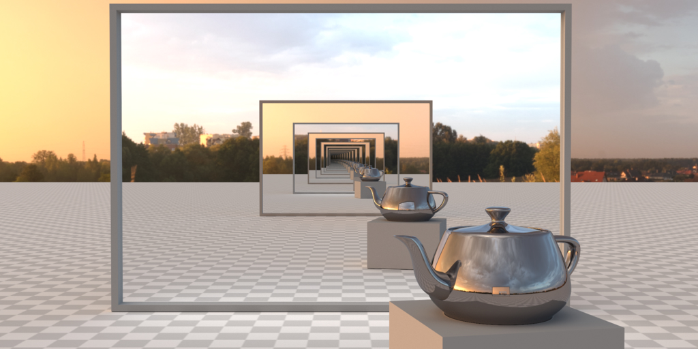](screenshots/100percent/screenshot-13-06-2018-15-34-01.jpg)|
|Infinite Mirror (64 max bounces)|
|[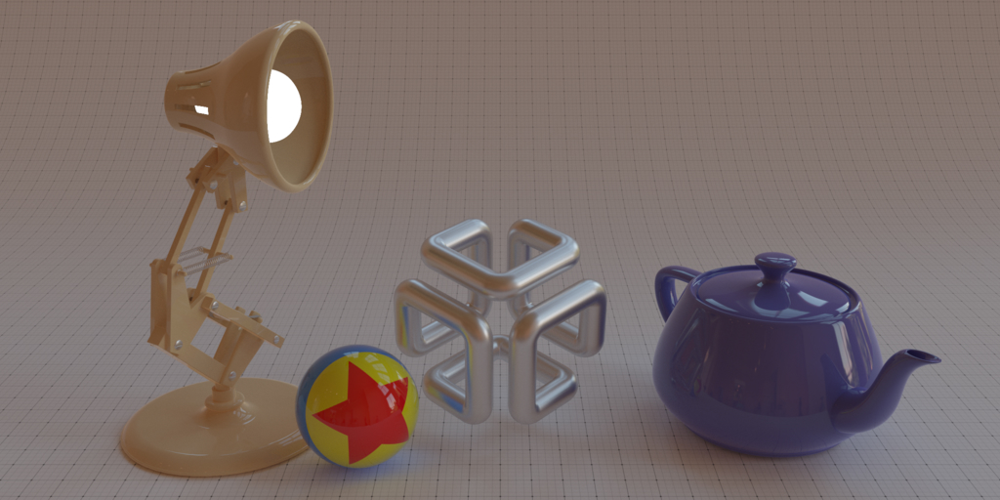](screenshots/100percent/screenshot-07-06-2018-11-47-47.jpg)|
|Luxo Jr. & Ball, SGI logo, and Utah Teapot|
|[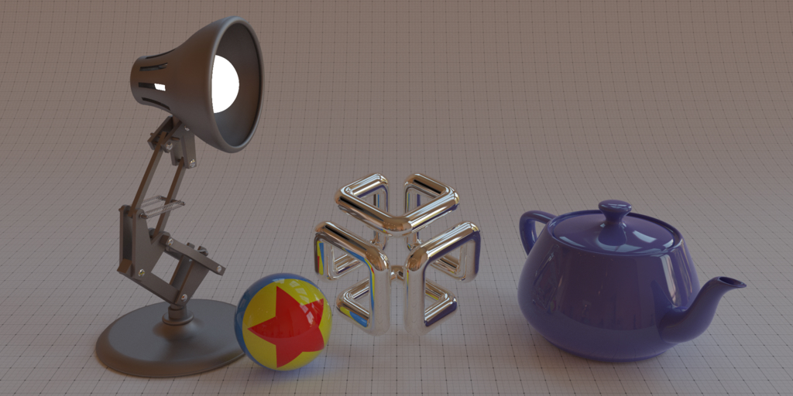](screenshots/100percent/screenshot-07-06-2018-14-19-36.jpg)|
|Luxo Jr. & Ball, SGI logo, and Utah Teapot|
|[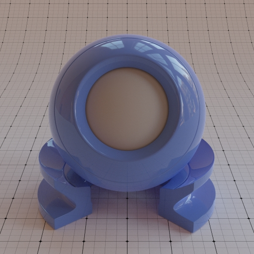](screenshots/100percent/screenshot-23-05-2018-10-05-35.jpg)|
|Smooth Plastic Material|
|[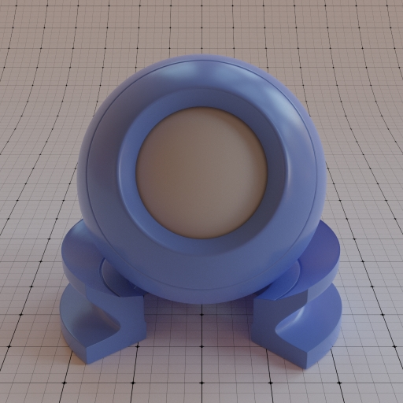](screenshots/100percent/screenshot-23-05-2018-10-08-01.jpg)|
|Rough Plastic Material|
|[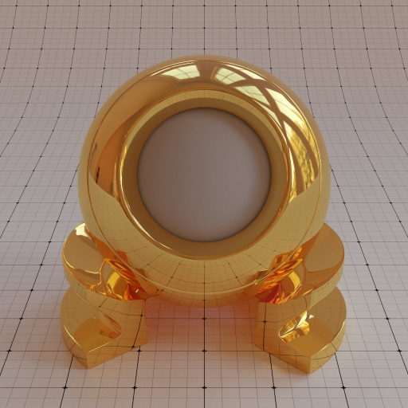](screenshots/100percent/screenshot-22-05-2018-13-28-56.jpg)|
|Smooth Metal Material (Gold)|
|[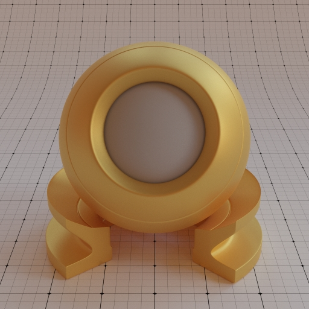](screenshots/100percent/screenshot-22-05-2018-13-27-03.jpg)|
|Rough Metal Material (Gold)|
|[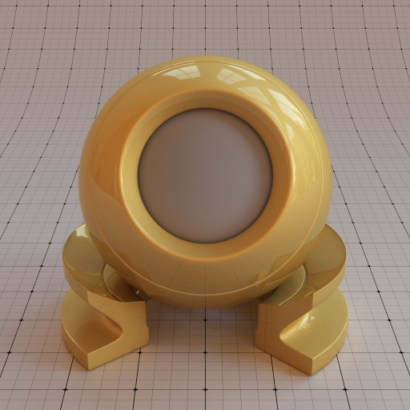](screenshots/100percent/screenshot-22-05-2018-13-13-45.jpg)|
|Clear Coat Material (Rough Gold Substrate + Specular Coating)|
|[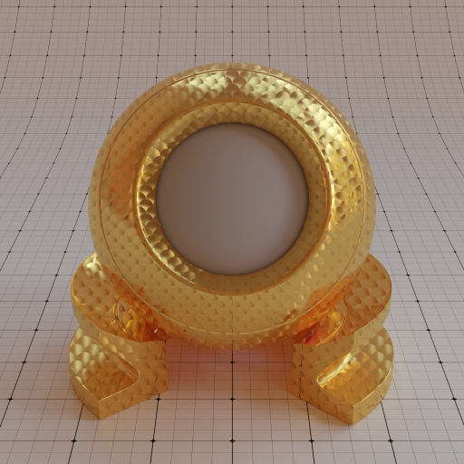](screenshots/100percent/screenshot-23-05-2018-10-15-17.jpg)|
|Anisotropic Roughness Texture|
|[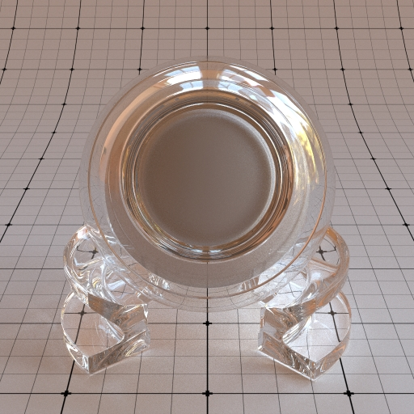](screenshots/100percent/screenshot-21-05-2018-13-47-19.jpg)|
|Smooth Glass|
|[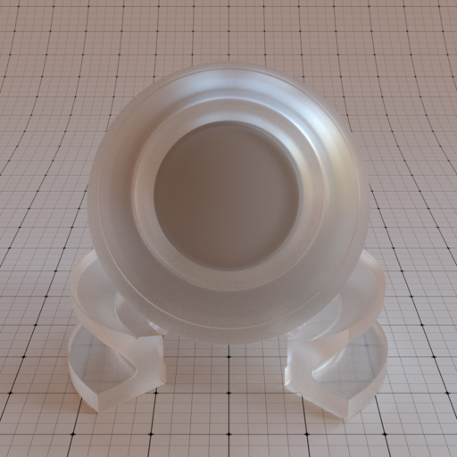](screenshots/100percent/screenshot-29-05-2018-18-30-13.jpg)|
|Rough Glass|
|[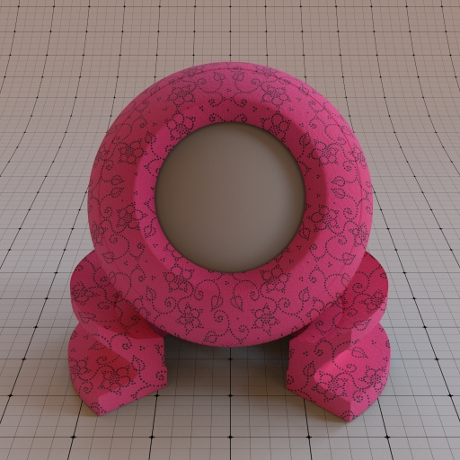](screenshots/100percent/screenshot-21-05-2018-12-46-57.jpg)|
|Flannel|
|[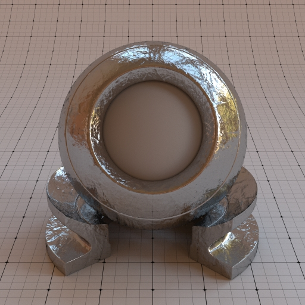](screenshots/100percent/screenshot-21-05-2018-13-09-10.jpg)|
|Aluminium Foil|
|[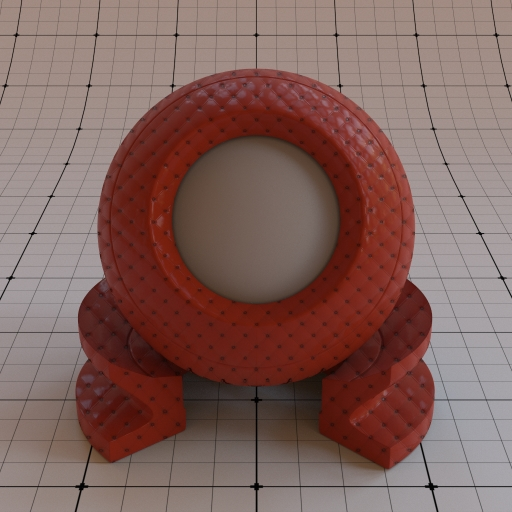](screenshots/100percent/screenshot-21-05-2018-14-21-41.jpg)|
|Leather|
|[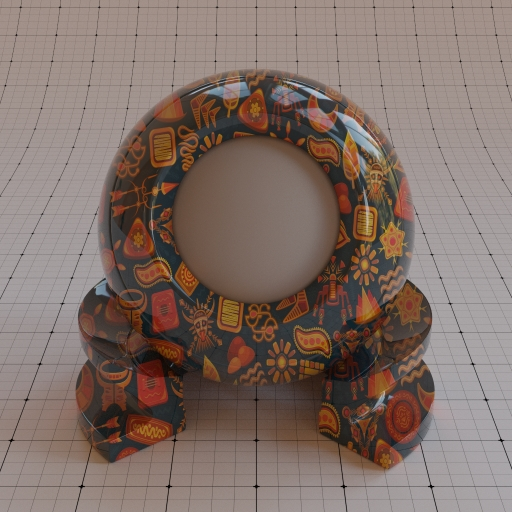](screenshots/100percent/screenshot-22-05-2018-15-44-15.jpg)|
|Fresnel Blend|
|[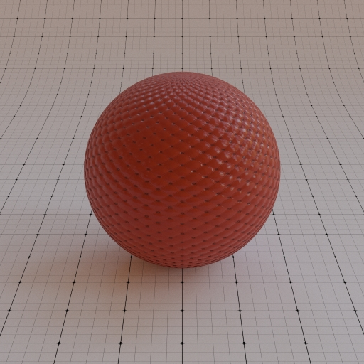](screenshots/100percent/screenshot-23-05-2018-14-34-53.jpg)|
|Leather|
|[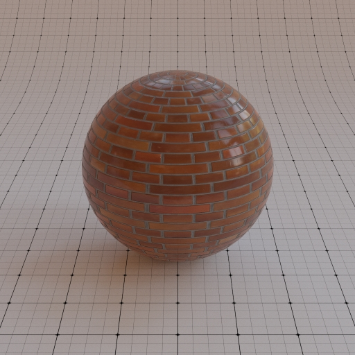](screenshots/100percent/screenshot-23-05-2018-14-35-44.jpg)|
|Brick|
|[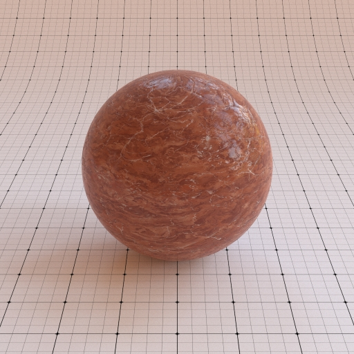](screenshots/100percent/screenshot-23-05-2018-15-31-13.jpg)|
|Marble|
|[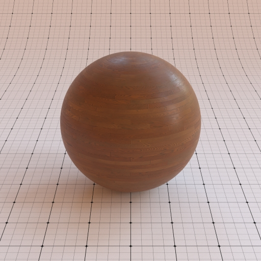](screenshots/100percent/screenshot-23-05-2018-15-34-58.jpg)|
|Wood|
|[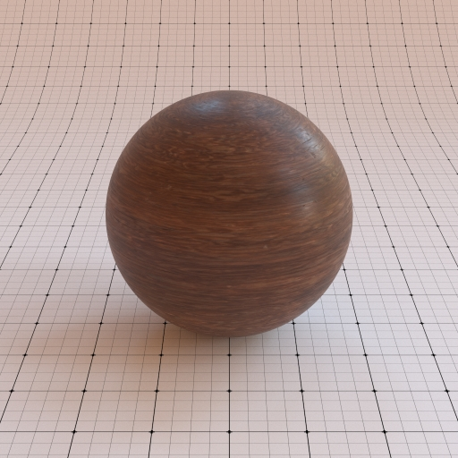](screenshots/100percent/screenshot-23-05-2018-15-38-04.jpg)|
|Semi Dark Wood|
|[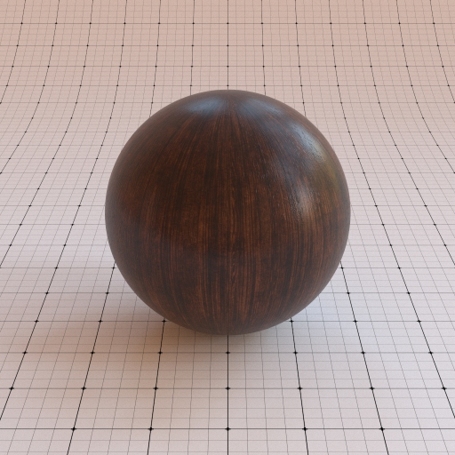](screenshots/100percent/screenshot-23-05-2018-15-39-32.jpg)|
|Dark Wood|
|[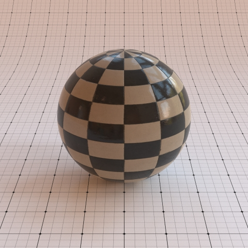](screenshots/100percent/screenshot-23-05-2018-15-46-56.jpg)|
|Tile|
|[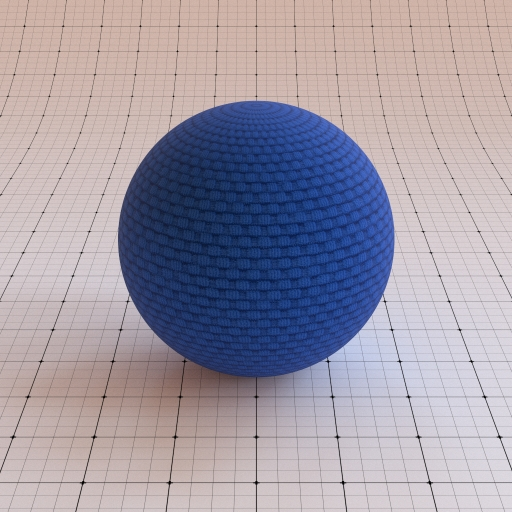](screenshots/100percent/screenshot-23-05-2018-15-51-09.jpg)|
|Spandex|
|[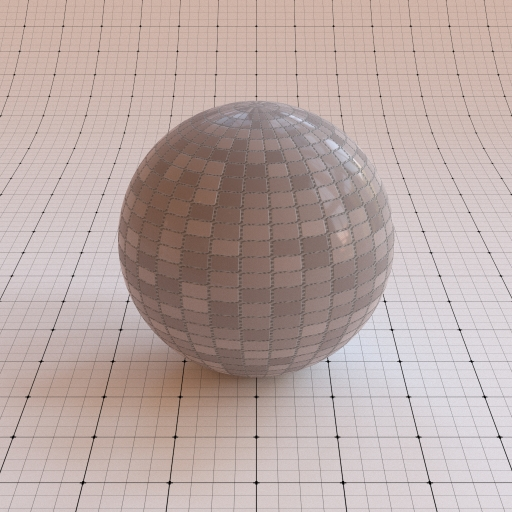](screenshots/100percent/screenshot-23-05-2018-15-58-59.jpg)|
|Chainmail Tile|
|[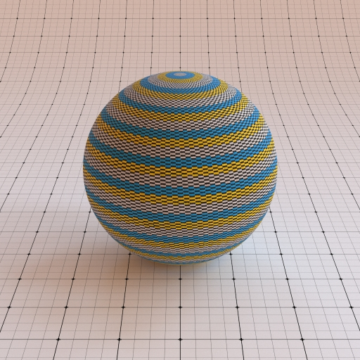](screenshots/100percent/screenshot-23-05-2018-15-56-55.jpg)|
|Diamond Plate|
|[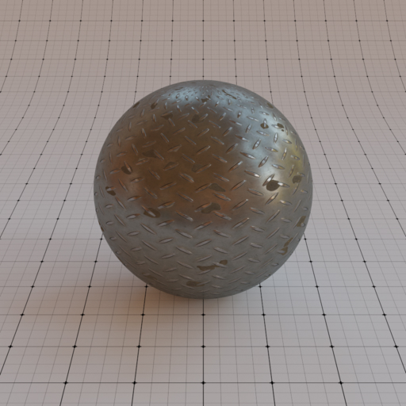](screenshots/100percent/screenshot-29-05-2018-13-18-04.jpg)|
|Rust|
|[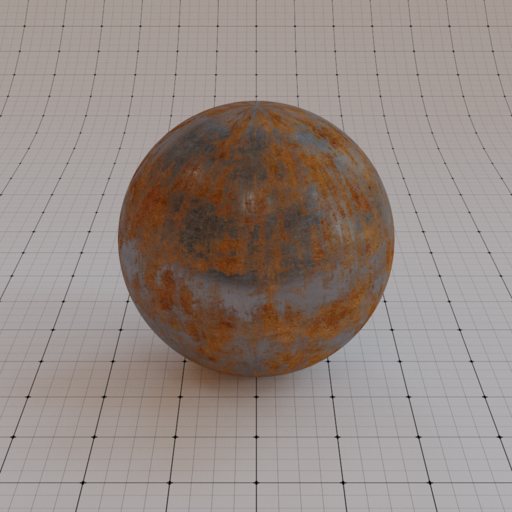](screenshots/100percent/screenshot-29-05-2018-14-21-34.jpg)|
|Scratched|
|[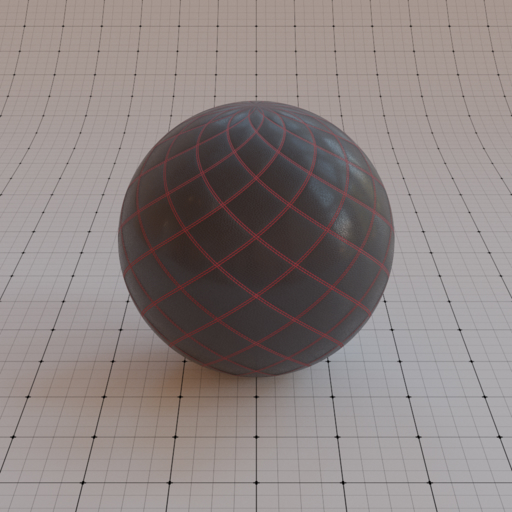](screenshots/100percent/screenshot-29-05-2018-15-12-52.jpg)|
|Leather|
|[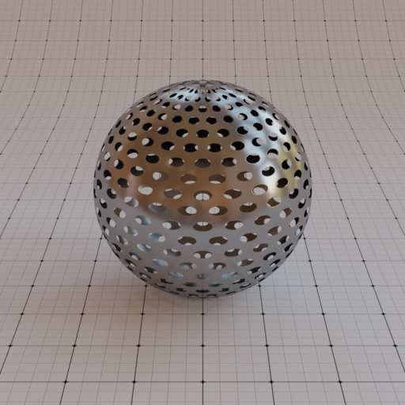](screenshots/100percent/screenshot-29-05-2018-16-00-16.jpg)|
|Metal Mesh|
|[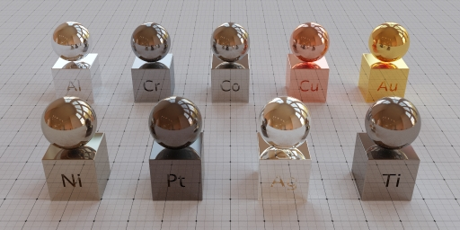](screenshots/100percent/screenshot-23-05-2018-10-28-41.jpg)|
|Smooth Metal|
|[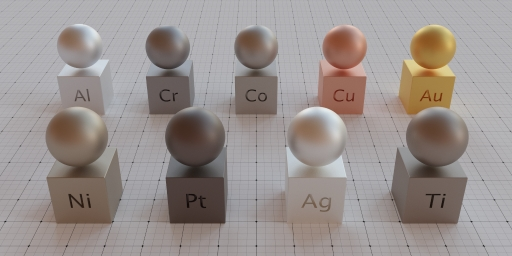](screenshots/100percent/screenshot-23-05-2018-10-32-29.jpg)|
|Rough Metal|
|[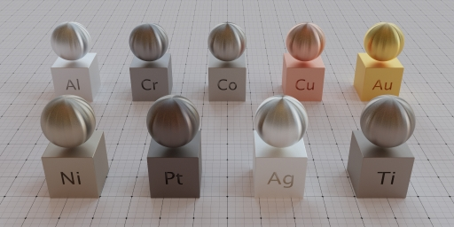](screenshots/100percent/screenshot-23-05-2018-10-27-41.jpg)|
|Anisotropic Roughness Metal|
|[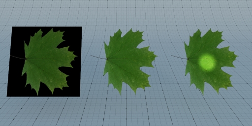](screenshots/100percent/screenshot-23-05-2018-11-56-01.jpg)|
|left: No Trasparency Middle: Transparency Right: Translucency (spot light behind the leaf)|
[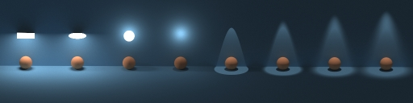](screenshots/100percent/screenshot-23-05-2018-12-13-36.jpg)
|Quad (double sided), Disk (double sided), Sphere Area Lights, Point Light, and Spot Lights|
[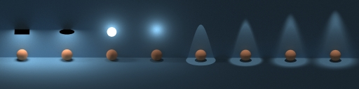](screenshots/100percent/screenshot-23-05-2018-12-14-17.jpg)
|Quad (single sided), Disk (single sided), Sphere Area Lights, Point Light, and Spot Lights|
[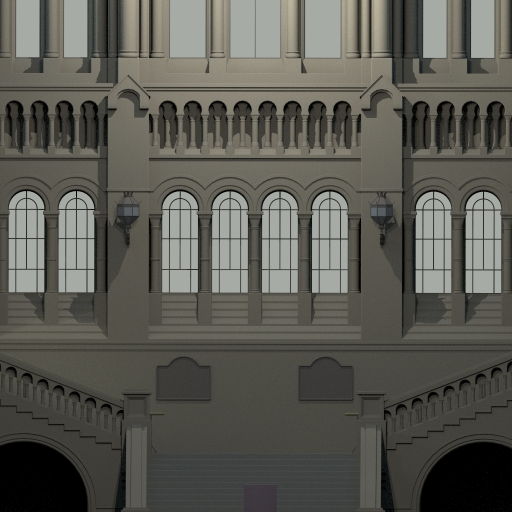](screenshots/100percent/screenshot-23-05-2018-12-46-45.jpg)
|Museum Orthographic Camera|
[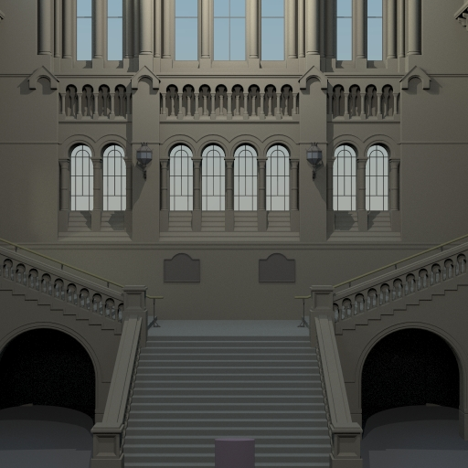](screenshots/100percent/screenshot-23-05-2018-12-49-44.jpg)
|Museum Perspective Camera|
[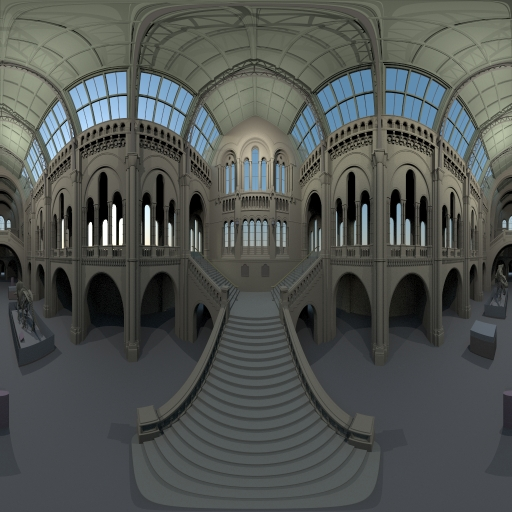](screenshots/100percent/screenshot-23-05-2018-12-52-59.jpg)
|Museum 360/Environment Camera|
[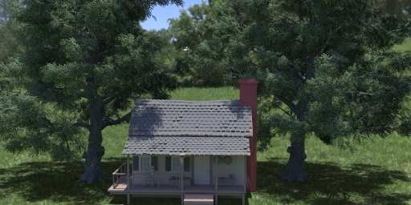](screenshots/100percent/screenshot-23-05-2018-13-26-10.jpg)
|Cabin Instanced Trees, Shadow Catcher Plane, and Environemnt Lighting|

|Train Scene Pinhole Camera|
[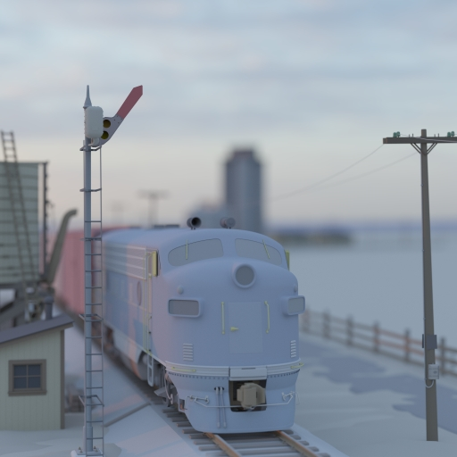](screenshots/100percent/screenshot-23-05-2018-14-19-09.jpg)
|Train Scene Thin Lens DOF|
[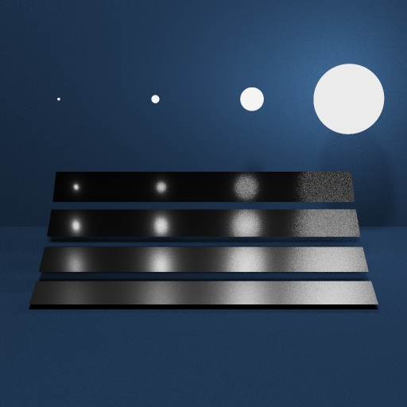](screenshots/100percent/screenshot-26-05-2018-15-47-11.jpg)
|Veach no MIS|

|Veach with MIS|
